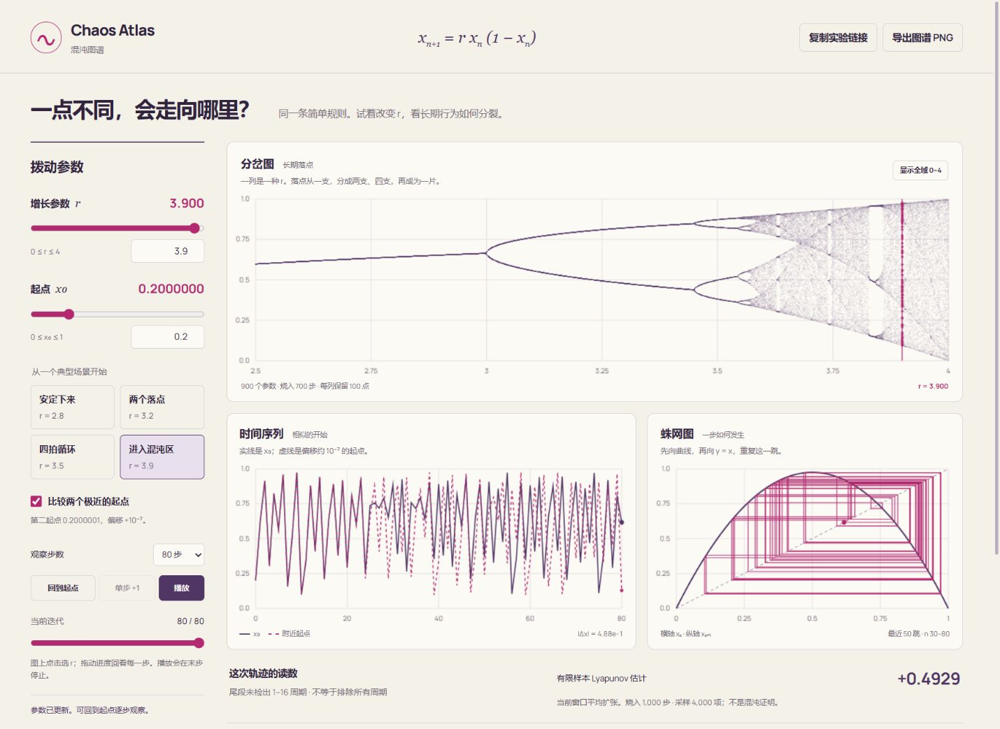

# Chaos Atlas · 混沌图谱

一个可以亲手拨动参数的数学实验：只用 `x[n+1] = r x[n] (1 − x[n])`，观察固定点、周期和对初值的敏感性。



GitHub Pages 目标地址：<https://wangchuan2003-a11y.github.io/chaos-atlas/>。以仓库 Actions 最近一次成功部署为实际上线状态。

## 玩什么

- **分岔图**：900 个参数各自迭代。默认聚焦 `r ∈ [2.5, 4]`，可切到 `[0, 4]`；点选图形改变当前 `r`。键盘可操作等价参数滑块。
- **时间序列**：从给定初值开始，查看 1–300 步；与相距约 `10⁻⁷` 的第二初值比较。
- **蛛网图**：在 logistic 曲线与 `y = x` 之间，一跳一跳查看迭代。为保持可读性，显示最近至多 50 跳。
- **预设**：`r = 2.8 / 3.2 / 3.5 / 3.9`，初值统一为 `0.2`。预设是探索入口，特殊初值仍可能给出不同结果。
- **控制**：播放、暂停、回到起点、单步、时间进度回看；默认静止，播放到末步自动停止，页面隐藏时自动暂停。
- **保存**：复制 `r / x₀ / 观察步数` 参数链接，或导出含当前三图与计算边界的 PNG。没有后端、账号、密钥或分析追踪。

先选“两个落点”，回到起点逐步走；再切换“进入混沌区”，观察两条轨迹何时开始明显分离。最后试 `x₀ = 0`：正 Lyapunov 估计也可能伴随一个固定轨迹。

## 本地运行

需要 Node.js 22 或更新的兼容 LTS 版本。

```sh
npm ci
npm run dev
```

开发地址：<http://127.0.0.1:5191/chaos-atlas/>。

```sh
npm run check
npm test
npm run build
```

静态产物在 `dist/`；Vite base 固定为 `/chaos-atlas/`。部署到不同路径时先修改 `vite.config.ts`。

无头浏览器回归使用隔离的测试浏览器，不操作已有的用户浏览器：

```sh
npx playwright install chromium
npm run build
npm run test:e2e
```

CI 会安装 Chromium 并运行桌面与移动尺寸测试；只有所有检查通过后，主分支才部署 GitHub Pages。首次使用需把仓库 Pages 来源设置为 GitHub Actions。

## 数学与证据边界

1. **定义域**：只支持 `0 ≤ r ≤ 4`、`0 ≤ x₀ ≤ 1`。在精确算术下该区间前向不变。本实现使用 JavaScript IEEE 754 双精度运算；图形点缓存使用 Float32。不是任意精度或符号证明工具。
2. **时间序列**：不烧入，包含 `x₀`。第二初值通常为 `x₀ + 10⁻⁷`，越过 1 时改为向下偏移；浮点表示使实际差值可能有微小误差。
3. **分岔图**：每个参数都从当前 `x₀` 开始，丢弃前 700 次迭代，再显示 100 点。900 个参数是有限分辨率采样，不是完整吸引子集合。零初值保持零；特殊初值不会被随机替换。Web Worker 计算，旧请求结果会被丢弃。
4. **Lyapunov 估计**：丢弃前 1,000 次迭代，随后取 4,000 项 `ln |r(1 − 2xₙ)|` 的平均。公式是自然对数、单位为每迭代步。采样窗口中若出现零导数，保留 `−∞`，不以小正数替代；烧入期间的导数不计入该有限窗口。
5. **正值不是混沌证明**：它表示沿当前数值轨迹的局部扰动平均扩张；比如 `r = 4, x₀ = 0` 的轨迹固定为零，但此估计为 `ln 4 > 0`。`r = 4` 的典型轨迹指数接近 `ln 2`；并非每个初值都遵循典型统计。
6. **周期提示**：独立烧入 1,000 步，在随后的 128 点里检查 1–16 周期候选，绝对容差 `10⁻⁸`，每个候选至少比较四轮。显示“近似周期”；没检出不代表排除更长周期或证明混沌。
7. **不是现实预测模型**：站点演示一个数学递推，不将轨迹直接解释为人口、金融或天气预测。

## 参考资料

- **原始研究**：Robert M. May, _Simple mathematical models with very complicated dynamics_, Nature 261, 459–467 (1976), [出版社官方页与 DOI](https://www.nature.com/articles/261459a0)。历史与模型背景来源；本项目检索了公开页面，没有将受限全文冒充已完整审阅的证据。
- **技术参考**：Eric W. Weisstein, [Logistic Map](https://mathworld.wolfram.com/LogisticMap.html), Wolfram MathWorld。公开正文介绍递推、固定点、周期倍增与分岔图构造。这是技术百科参考，区别于原始研究。
- **本项目可复算的证据**：`tests/math.test.mjs` 检查区间不变性、解析固定点、解析 2 周期、4 周期预设、零导数语义、`r=4` 典型指数容差及正指数固定轨迹反例。数值测试验证实现与已知性质相容，不代替数学证明。

## 结构

```text
src/math.ts                 数学内核、参数验证与分享协议
src/bifurcation.worker.ts    有限分岔采样的 Web Worker
src/main.ts                 控件、Canvas 绘图与导出
src/style.css               响应式和可访问性样式
tests/math.test.mjs          数学性质与输入边界
tests/browser/              桌面/移动交互回归
.github/workflows/pages.yml 检查、浏览器测试、Pages 部署
```

MIT 许可证。界面字形使用自托管 Manrope（SIL Open Font License），中文使用系统字体；字体分发许可证随站点发布，见 [public/manrope-license.txt](public/manrope-license.txt)。
